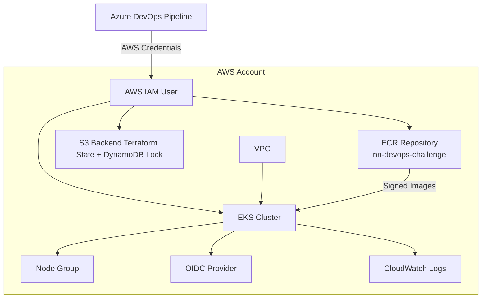
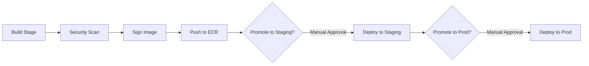

# 🚀 NN DevOps Challenge – Complete End-to-End Solution

<p></p>

[//]: # (README.md generated by gotmpl. DO NOT EDIT.)

 

This repository implements a full DevOps workflow designed for the NN DevOps Challenge.
Although the challenge only requires deploying a sample application to EKS, this solution goes further by providing a multi-environment production-ready setup, including:

* Infrastructure as Code (Terraform)
* Three isolated environments (dev, staging, prod) (only dev is used for the challenge exercise)
* Automated Docker build workflow for a SpringBoot app generated with https://start.spring.io/
* Security scanning with Trivy
* Image signing & verification using Cosign
* Push to ECR
* Deployments to EKS via Helm
* Azure DevOps multi-stage CI/CD pipeline
* GitOps-friendly structure
* Makefile automation for local workflows
* IAM least privilege policy for Terraform service accounts

## 📁 Repository Structure

```
.
├── aws
│   └── policies
│       └── iam.json
├── azure-pipelines.yml
├── Dockerfile
├── helm
│   └── nn-devops-challenge
│       ├── Chart.yaml
│       ├── templates
│       │   ├── _helpers.tpl
│       │   ├── deployment.yaml
│       │   └── service.yaml
│       └── values.yaml
├── infra
│   ├── backend.tf
│   ├── main.tf
│   ├── modules
│   │   ├── ecr
│   │   │   ├── main.tf
│   │   │   ├── outputs.tf
│   │   │   ├── README.md
│   │   │   └── variables.tf
│   │   ├── eks
│   │   │   ├── main.tf
│   │   │   ├── outputs.tf
│   │   │   ├── README.md
│   │   │   └── variables.tf
│   │   ├── iam
│   │   │   ├── main.tf
│   │   │   ├── outputs.tf
│   │   │   ├── README.md
│   │   │   └── variables.tf
│   │   └── network
│   │       ├── main.tf
│   │       ├── outputs.tf
│   │       ├── README.md
│   │       └── variables.tf
│   ├── outputs.tf
│   ├── README.md
│   └── variables.tf
├── Makefile
├── pom.xml
├── README.md
├── renovate.json
├── scripts
│   └── deploy.sh
└── src
    └── main
        ├── java
        │   └── com
        │       └── example
        │           └── springbootapp
        │               └── DemoApplication.java
        └── resources
            └── application.properties
```

## 🏗️ Infrastructure Overview

Terraform provisions:

* EKS clusters (dev, staging, prod)
* Managed node groups
* OIDC Provider for IRSA
* ECR repository
* IAM roles for EKS, nodes, and the CI/CD pipeline
* Optional default VPC usage
* CloudWatch log groups
* KMS Key for cluster encryption
* S3 remote backend with DynamoDB locking

## 🗺️ Architecture Diagram (Infrastructure)



## 🐳 CI/CD Pipeline Diagram (Azure DevOps)



## 🔧 Pipeline Stages Explained

### **Stage 1 – Build**
- Build Java project  
- Build Docker image  

### **Stage 2 – Security Scan (Trivy)**

```
trivy image --severity CRITICAL --exit-code 1
```

### **Stage 3 – Cosign Signing**

```
cosign sign --key cosign.key $IMAGE
```

### **Stage 4 – Push to ECR**

```
aws ecr get-login-password | docker login
docker push $IMAGE
```

### **Stage 5 – Promotion Gates**
- Dev → staging → prod  
- Azure DevOps manual approvals  
- Cosign verification at every stage  

### **Stage 6 – Deployment to EKS (Helm)**

```
helm upgrade --install app ./helm/nn-devops-challenge \
  --set image.repository=$IMAGE_REPO \
  --set image.tag=$TAG \
  --namespace nn-devops

```

## 🛠️ Makefile Commands (Local Automation)

### Application tasks

```
make test
make build
make scan
make push
make sign
make verify
```

### Terraform tasks

```
# Init
make tf-init ENV=dev

# Plan
make tf-plan ENV=dev

# Apply (dev cluster used for the challenge)
make tf-apply ENV=dev

# Destroy (recommended for AWS Free Tier)
make tf-destroy ENV=dev

```

## 🧹 Cleanup Strategy (AWS Free Tier)

To avoid being charged when testing:

1. Destroy EKS cluster
2. Destroy node groups
3. Delete Load Balancers
4. Delete ECR images
5. Delete IAM roles
6. Delete CloudWatch log groups
7. (Optional) Clean S3 backend

Just run:

```
make tf-destroy ENV=dev
```