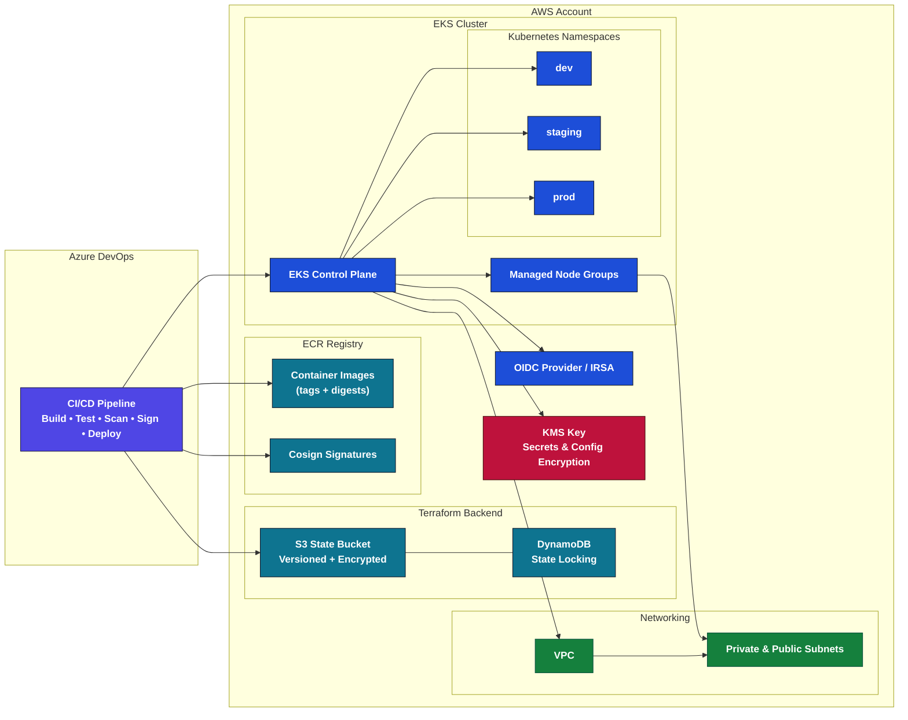

# 🚀 Complete End-to-End Solution
[//]: # (README.md generated by gotmpl. DO NOT EDIT.)

 

[?branchName=main)](https://dev.azure.com/sofia-nn-challenge/nn-devops-challenge/_build/latest?definitionId=2&branchName=main)

This repository implements a full DevOps workflow designed to deploy a simple Spring Boot application to EKS, this solution extends far beyond that by providing a **multi-environment, fully secure, auditable CI/CD system**.

* Infrastructure as Code (Terraform)
* Three isolated clusters (dev, staging, prod)
* Used DEV clusters to promotes through dev --> staging --> prod using namespaces
* Automated Docker build workflow for a SpringBoot app generated with https://start.spring.io/
* Security scanning with Trivy
* Image signing & verification using Cosign
* Push to ECR
* Deployments to EKS via Helm
* Azure DevOps multi-stage CI/CD pipeline
* GitOps-friendly structure
* Makefile automation for local workflows
* IAM least privilege policy for Terraform service accounts

## Infrastructure Overview

Terraform provisions:

* EKS clusters (dev, staging, prod)
* Managed node groups
* OIDC (IRSA) for pod-level IAM
* ECR private registry
* IAM roles for EKS, nodes, and the CI/CD pipeline
* Optional default VPC usage
* S3 backend for Terraform state + DynamoDB lock

## Architecture Diagram (Infrastructure)



## CI/CD Pipeline Diagram (Azure DevOps)

```mermaid
flowchart TD

%% =========================
%% Feature / non-main branches
%% =========================
subgraph Feature["Feature / Non-main branches"]
  FB_COMMIT["Commit on feature/* branch"] --> FB_BTS["BuildTestScan<br/>Unit tests + Maven + Trivy"]
  FB_BTS --> FB_OK{"BuildTestScan succeeded?"}
  FB_OK -->|Yes| FB_PUSH["PushAndSign<br/>Docker build + Cosign sign + push to ECR"]
  FB_OK -->|No| FB_STOP["Stop pipeline"]
end

%% =========================
%% Pull Request validation
%% =========================
subgraph PRFlow["Pull Request validation → main"]
  PR["Open PR targeting main"] --> PR_BTS["BuildTestScan<br/>Validation pipeline"]
  PR_BTS --> PR_OK{"BuildTestScan succeeded?"}
  PR_OK -->|Yes| PR_PUSH["PushAndSign<br/>(same flow as branches)"]
  PR_OK -->|No| PR_STOP["Stop PR pipeline"]
end

%% =========================
%% main branch CI/CD
%% =========================
subgraph Main["main branch CI/CD"]
  MAIN_COMMIT["Commit merged into main"] --> MAIN_BTS["BuildTestScan"]
  MAIN_BTS --> MAIN_OK{"BuildTestScan succeeded?"}
  MAIN_OK -->|Yes| MAIN_PUSH["PushAndSign<br/>build + sign + push"]
  MAIN_OK -->|No| MAIN_STOP["Stop pipeline"]

  MAIN_PUSH --> APPROVE_DEV{"Manual approval<br/>Deploy to dev?"}
  APPROVE_DEV -->|Approved| VERIFY_DEV["Cosign verify (dev)"]
  VERIFY_DEV --> DEPLOY_DEV["Deploy_Dev<br/>Helm upgrade to dev namespace"]

  DEPLOY_DEV --> APPROVE_STG{"Manual approval<br/>Promote to staging?"}
  APPROVE_STG -->|Approved| VERIFY_STG["Cosign verify (staging)"]
  VERIFY_STG --> DEPLOY_STG["Deploy_Staging<br/>Helm upgrade to staging"]

  DEPLOY_STG --> APPROVE_PROD{"Manual approval<br/>Promote to prod?"}
  APPROVE_PROD -->|Approved| VERIFY_PROD["Cosign verify (prod)"]
  VERIFY_PROD --> DEPLOY_PROD["Deploy_Prod<br/>Helm upgrade to prod"]
end

%% =========================
%% Renovate
%% =========================
RENOVATE["Renovate Bot<br/>(scheduled weekly)"] --> RENOVATE_PR["Automated PRs<br/>Dependencies • Terraform • Docker • Helm"]
RENOVATE_PR --> PR

%% =========================
%% Styling
%% =========================
classDef stage fill:#6b21a8,stroke:#3b0764,color:white,font-weight:bold;
classDef build fill:#1d4ed8,stroke:#0f172a,color:white,font-weight:bold;
classDef scan fill:#be123c,stroke:#450a0a,color:white,font-weight:bold;
classDef sign fill:#0f766e,stroke:#064e3b,color:white,font-weight:bold;
classDef deploy fill:#15803d,stroke:#064e3b,color:white,font-weight:bold;
classDef renovate fill:#9333ea,stroke:#581c87,color:white,font-weight:bold;

class FB_BTS,PR_BTS,MAIN_BTS build
class FB_PUSH,PR_PUSH,MAIN_PUSH stage
class VERIFY_DEV,VERIFY_STG,VERIFY_PROD sign
class DEPLOY_DEV,DEPLOY_STG,DEPLOY_PROD deploy
class APPROVE_DEV,APPROVE_STG,APPROVE_PROD stage
class RENOVATE,RENOVATE_PR renovate

```



## CI/CD Stages Summary

1. BuildTestScan
    * Maven build
    * Unit tests
    * Docker build
    * Trivy vulnerability scan (fail on CRITICAL)

2. PushAndSign
    * Push image to the AWS ECR repository
    * Sign the image using Cosign
    * Upload signatures to ECR
3. Environment Promotions
    * dev → staging → prod via manual approvals
    * Cosign signature verification before every deployment
    * Helm upgrade with per-environment overrides
4. Renovate Bot (Weekly)
    * Automated dependency PRs (Java, Terraform, Helm, Docker)

This structure closely aligns with secure enterprise pipelines used in production.

## 🔐 Security & Supply Chain Protection

This solution integrates multiple layers of security:

### 1️⃣ Container Security (Trivy)

* Image scanned on each build

* Fails pipeline if CRITICAL vulnerabilities are detected

* Ensures secure base image and dependencies

### 2️⃣ Image Signing (Cosign)

* Images are signed with a private key

* Signatures are uploaded to the registry

* Verification gates prevent unsigned images from being deployed

### 3️⃣ IAM Least Privilege

* Isolated roles for:
  * Terraform
  * Node groups

### 4️⃣ Secure Terraform Backend

* S3 bucket with:
  * versioning
  * encryption at rest
* DynamoDB table used for:
  * state locking

## 🛠️ Makefile Commands

```
Available commands:

  build                     Build Docker image
  chartsnap-install         Install chartsnap
  chartsnap-snapshot-all    Snapshot all envs (dev/staging/prod)
  chartsnap-update          Update snapshots for all envs (local only)
  cosign-check              Ensure keys exist and password set
  cosign-install            Install cosign
  deploy-dev                Deploy to dev
  deploy-prod               Deploy to prod
  deploy-staging            Deploy to staging
  helm-ci-test              Helm lint + snapshot tests for dev/staging/prod
  helm-lint                 Lint Helm chart with all env values
  help                      Show this help message
  image-digest              Get digest from ECR
  login-ecr                 Login to ECR
  package                   Build + scan
  print-cosign-env          Debug: print COSIGN_PASSWORD from make
  push                      Push to ECR
  run                       Run locally
  scan                      Trivy scan
  sign-digest               Sign by digest
  sign                      Sign by tag
  test                      Run unit tests
  tf-apply                  Terraform apply
  tf-destroy                Terraform destroy
  tf-docs                   Generate Terraform docs
  tf-fmt                    Format Terraform code
  tf-init                   Initialize Terraform
  tf-output                 Show Terraform outputs
  tf-plan                   Terraform plan for environment (ENV=dev/staging/prod)
  tf-validate               Validate Terraform code
  verify-digest             Verify by digest
  verify                    Verify tag
```

## Azure DevOps Self-Hosted Agent (Required Component)

This project uses a **self-hosted Azure DevOps agent** to support all the tooling required for the CI/CD pipeline.  
Microsoft-hosted agents do **not** allow privileged operations such as:
- Docker build & push  
- Cosign signing  
- Terraform apply  
- AWS CLI with persistent credentials  
- Local artifacts caching  
- Custom binaries installation  

For this reason, the pipeline runs on a dedicated **self-hosted Linux agent** deployed on a secure environment.

---

### ✔️ Agent Capabilities Installed

The agent was configured with the following tooling to support the full DevOps workflow:

- **Docker Engine** (build + push)  
- **AWS CLI v2** (ECR login and Terraform authentication)  
- **Terraform** (IaC provisioning)  
- **kubectl** (cluster interactions)  
- **Helm** (EKS deployments with charts)  
- **Cosign** (image signing and verification)  
- **Trivy** (container vulnerability scanning)  
- **Java 17 / Maven** (Spring Boot build workflow)  
- **Git**  
- **Azure DevOps Agent runtime**

This ensures the pipeline can execute all stages without restrictions.

---

### 🔐 Security Considerations for the Self-Hosted Agent

To maintain a secure and controlled supply chain:

- The agent runs isolated in a **private network**  
- Only outbound connections to Azure DevOps are allowed  
- AWS credentials are injected at runtime via Azure Pipeline secure variables  
- No long-lived credentials are stored on disk  
- Docker is restricted to controlled build contexts  
- The agent only receives IAM permissions required for:  
  - ECR authentication  
  - ECR image push  
  - Terraform backend access  
  - (Optional) EKS interactions  

---

### 🛠️ Pipeline Configuration

The pipeline explicitly targets the self-hosted agent pool:

```yaml
pool:
  name: 'sofia-self-hosted'
```

## 🔄 Automated Dependency Management – Renovate (not for this challenge)

To keep the stack secure and reduce manual maintenance, this repository uses [Renovate Bot](https://docs.renovatebot.com/) to automatically detect and propose dependency updates.

### What Renovate manages

The `renovate.json` configuration in the repository root enables Renovate to manage:

- **Terraform modules** (EKS, VPC, IAM, etc.)
- **Helm charts and values** for the application deployment
- **Java dependencies** (Spring Boot, libraries defined in `pom.xml`)
- **Docker base images** used in the `Dockerfile`
- **Container images referenced in CI/CD YAML** (e.g. Trivy, Helm, kubectl in `azure-pipelines.yml`)
- **CLI tooling installed from GitHub releases** (cosign, trivy, helm, kubectl)

Dependencies are grouped into logical PRs (Terraform, Helm, Java, Docker, CLI tools) to keep reviews focused and readable.

### How Renovate runs

Renovate is executed as a separate Azure DevOps job using the official `renovate/renovate` Docker image:

- A dedicated pipeline stage (`renovate`) runs on a **self-hosted Linux agent**.
- The job is triggered on a **schedule** (e.g. before 04:00 every Monday, Europe/Madrid).
- Authentication is done via an Azure DevOps Personal Access Token (PAT) stored as a secure variable `RENOVATE_TOKEN`.
- Renovate connects to the Azure DevOps API (`platform=azure`) and scans this repository according to `renovate.json`.
- For each update, Renovate opens **Pull Requests** against the `main` branch.

Every Renovate PR automatically triggers the **same CI/CD pipeline** as regular changes:

1. Build & unit tests
2. Trivy image scan
3. Cosign signing
4. Push to ECR
5. Optional Helm deploy to EKS (dev/staging/prod based on environment)

This ensures that **all dependency updates go through the full build, security scan and deployment process** before being merged.

### Why Renovate is used in this challenge

Although the original NN DevOps Challenge only requires deploying a sample application, adding Renovate demonstrates:

- **Production-grade maintenance practices** (automated dependency management)
- **Security by design**, keeping images and libraries up to date
- **Clear separation of concerns** between feature development and dependency updates
- **GitOps-friendly workflow**, where all changes (including version bumps) are traceable via Pull Requests

In a real-world scenario, this significantly reduces toil for the DevOps team and helps keep the AWS, Kubernetes and Spring Boot stack secure over time.

## 🧹 Cleanup Strategy (AWS Free Tier)

To avoid being charged when testing:

1. Destroy EKS cluster
2. Destroy node groups
3. Delete Load Balancers
4. Delete ECR images
5. Delete IAM roles
6. Delete CloudWatch log groups
7. (Optional) Clean S3 backend

Just run:

```
make tf-destroy ENV=dev
```

## 🚀 Future Improvements & Enhancements

### 🔐 Security

* SBOM generation (Syft) + Grype scanning
* OPA Gatekeeper / Kyverno image-signing policies
* Attestations + SLSA compliance

### 📈 Observability

* Grafana dashboards (latency, saturation, error rate)
* Prometheus alert rules
* Centralized logging (Loki / CloudWatch / ELK)

### 🧩 Deployment & GitOps

* ArgoCD migration
* Argo Rollouts for canary
* Policy-as-Code enforcement

### 💰 Cost Optimization

* Spot node groups
* Image pruning
* Right-sizing with Compute Optimizer

### 🛠️ IaC Enhancements

* Terragrunt structure
* Pre-commit hooks (tflint, tfsec, checkov)
* Drift detection


## Useful links

* [Azure DevOps Pipelines Documentation](https://learn.microsoft.com/es-es/azure/devops/pipelines/?view=azure-devops)
* [Renovate Bot](https://docs.renovatebot.com/)
