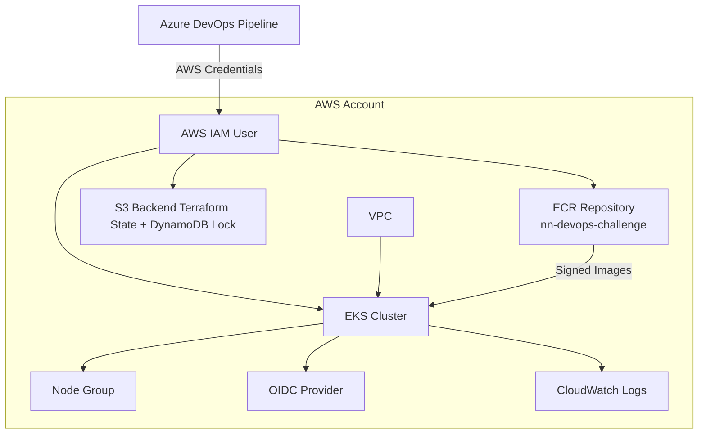
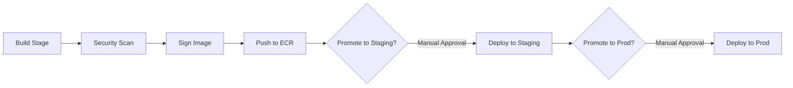

# 🚀 NN DevOps Challenge – Complete End-to-End Solution

<p></p>

[//]: # (README.md generated by gotmpl. DO NOT EDIT.)

 

This repository provides a fully automated DevOps workflow:

- **Infrastructure as Code** with Terraform  
- **Azure DevOps Pipeline** with promotion: dev → staging → prod  
- **Docker build** for a Spring Boot application  
- **Security scanning** with Trivy  
- **Image signing & verification** using Cosign  
- **Push to AWS ECR**  
- **Deployment to EKS using Helm & kubectl**  
- **IAM least-privilege model**  
- **Makefile automation**  

## 📁 Repository Structure

```
.
├── aws
│   └── policies
│       └── iam.json
├── azure-pipelines.yml
├── Dockerfile
├── helm
│   └── nn-devops-challenge
│       ├── Chart.yaml
│       ├── templates
│       │   ├── _helpers.tpl
│       │   ├── deployment.yaml
│       │   └── service.yaml
│       └── values.yaml
├── infra
│   ├── backend.tf
│   ├── main.tf
│   ├── modules
│   │   ├── ecr
│   │   │   ├── main.tf
│   │   │   ├── outputs.tf
│   │   │   ├── README.md
│   │   │   └── variables.tf
│   │   ├── eks
│   │   │   ├── main.tf
│   │   │   ├── outputs.tf
│   │   │   ├── README.md
│   │   │   └── variables.tf
│   │   ├── iam
│   │   │   ├── main.tf
│   │   │   ├── outputs.tf
│   │   │   ├── README.md
│   │   │   └── variables.tf
│   │   └── network
│   │       ├── main.tf
│   │       ├── outputs.tf
│   │       ├── README.md
│   │       └── variables.tf
│   ├── outputs.tf
│   ├── README.md
│   └── variables.tf
├── Makefile
├── pom.xml
├── README.md
├── renovate.json
├── scripts
│   └── deploy.sh
└── src
    └── main
        ├── java
        │   └── com
        │       └── example
        │           └── springbootapp
        │               └── DemoApplication.java
        └── resources
            └── application.properties
```

## 🏗️ Infrastructure Overview

Terraform provisions:

- **EKS Cluster**
- **Node Group**
- **OIDC Provider**
- **ECR Repository**
- **IAM roles for EKS, ECR & Azure DevOps**
- **Optional VPC or default VPC**
- **CloudWatch log groups**
- **KMS key for encryption**
- **S3/DynamoDB remote state**

## 🗺️ Architecture Diagram (Infrastructure)



## 🐳 CI/CD Pipeline Diagram (Azure DevOps)



## 🔧 Pipeline Stages Explained

### **Stage 1 – Build**
- Build Java project  
- Build Docker image  

### **Stage 2 – Security Scan (Trivy)**

```
trivy image --severity CRITICAL --exit-code 1
```

### **Stage 3 – Cosign Signing**

```
cosign sign --key cosign.key $IMAGE
```

### **Stage 4 – Push to ECR**

```
aws ecr get-login-password | docker login
docker push $IMAGE
```

### **Stage 5 – Promotion Gates**
- Dev → staging → prod  
- Azure DevOps manual approvals  
- Cosign verification at every stage  

### **Stage 6 – Deployment to EKS (Helm)**

```
helm upgrade --install nn-devops ./helm \
  --set image.repository=$IMAGE_REPO \
  --set image.tag=$TAG \
  --namespace nn-devops
```

## 🛠️ Makefile Commands

### Application tasks

```
make test
make build
make scan
make push
make sign
make verify
```

### Terraform tasks

```
make tf-init
make tf-plan
make tf-apply
make tf-destroy
make tf-output
make tf-fmt
make tf-validate
```

## 🌩️ How to Deploy Infrastructure (Local)

### Init

```
make tf-init
```

### Plan

```
make tf-plan
```

### Apply

```
make tf-apply
```

### Destroy (Important for AWS Free Tier)

```
make tf-destroy
```

Terraform removes everything cleanly.

## 🧹 Cleanup Strategy (AWS Free Tier)

To avoid being charged when testing:

1. Remove EKS cluster  
2. Remove node groups  
3. Remove load balancers  
4. Remove ECR images  
5. Remove IAM roles  
6. Remove VPC (if not default)  
7. Remove S3 & DynamoDB backend manually (optional)  

Just run:

```
make tf-destroy
```

## 📌 Summary

| Component | Status |
|----------|--------|
| Terraform Infra (EKS/ECR/IAM/VPC) | ✅ |
| CI/CD with Azure DevOps | ✅ |
| Docker Build | ✅ |
| Trivy Scan | ✅ |
| Cosign Signing + Verification | ✅ |
| Deploy to EKS via Helm | ✅ |
| Promotion with Approvals | ✅ |
| Diagrams | ✅ |
| Makefile Automation | ✅ |
